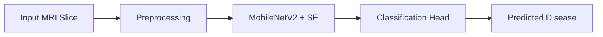

<h1 align="center">🧠 Neurodegenerative Disease Detection using CNN</h1>

  <b>🎓 Undergraduate Thesis Project (Completed)</b> 
  <i>Detection of Alzheimer’s, Parkinson’s & FTD from MRI using Deep Learning</i>  
  
  
  

---

## 🚀 Overview

This research focuses on the early diagnosis of **Alzheimer’s**, **Parkinson’s**, and **Frontotemporal Dementia (FTD)** using **2D sagittal MRI slices** with a **pseudo-3D deep learning pipeline**.

Our custom model, **SadNetV1**, builds on **MobileNetV2** and enhances feature learning with **Squeeze-and-Excitation (SE) attention blocks** for high-performance, lightweight disease classification.

> 🧾 Status: Successfully submitted and defended at **BRAC University, Dept. of CSE**  
> 🔐 Code & datasets are private due to ethical and academic regulations

---

## 📚 Datasets Used

- **ADNI** – Alzheimer’s MRI data  
- **PPMI** – Parkinson’s data  
- **FTD** – Neuroimaging data for Frontotemporal Dementia  

**Preprocessing includes:**
- 🎚️ Intensity clipping (0–255)
- 🎨 Conditional CLAHE
- 📏 Resizing (224×224)
- 🧼 Normalization
- 🧾 Saved as `.png` format

### 🧪 Sample MRI Slice

---

## 🔄 Data Preprocessing Pipeline

---

## 📈 Data Augmentation Process

- 🔀 Dataset split into Train, Validation, Test sets
- 🔄 Applied rotation, zoom, flips, contrast shifts

### 📊 Split Summary

### 🧪 Augmentation Pipeline

---

## 🔧 Model Workflow Diagram

---

## 🧠 Model Architecture – SadNetV1

- 🧩 **Base**: MobileNetV2  
- 🔁 **Attention**: Squeeze-and-Excitation (SE) Blocks  
- 🎯 **Input**: Stacked 2D sagittal MRI (Pseudo-3D)  
- ⚙️ **Optimizer**: Adam (`lr=1e-5`)  
- 📉 **Loss**: Categorical Crossentropy  

---

## 📊 Performance Summary

SadNetV1 achieved strong results across all diseases:

- ✅ **Train Accuracy**: 96.84%  
- ✅ **Validation Accuracy**: 97.11%  
- ✅ **Test Accuracy**: 96.15%

---

## 📈 Results & Visualizations

<table>
  <tr>
    <td align="center"><b>📊 Accuracy Graph</b></td>
    <td align="center"><b>📉 Loss Graph</b></td>
  </tr>
  <tr>
    <td></td>
    <td></td>
  </tr>
</table>

---

## 🧠 Prediction Results

<table>
  <tr>
    <td align="center"><b>Predicted: Alzheimer’s Disease (AD)</b></td>
    <td align="center"><b>Predicted: Parkinson’s Disease (PD)</b></td>
    <td align="center"><b>Predicted: Frontotemporal Dementia (FTD)</b></td>
  </tr>
  <tr>
    <td></td>
    <td></td>
    <td></td>
  </tr>
</table>

---

## 🌍 Future Work

- 🌐 Deploy as an interactive web app
- 🧬 Integrate multi-modal inputs (MRI + PET)
- 🧠 Add attention explainability with SHAP & Grad-CAM++

---

## 🛠️ Tech Stack

- 💻 Python
- 🔬 PyTorch
- 🖼 OpenCV
- 📊 NumPy, Pandas
- 📈 Matplotlib, Seaborn
- 🧠 NiBabel, pydicom
- 🧪 Jupyter Notebook

---

## 📎 Author & Contact

**👨‍💻 Shadman Rahman Sameen**  
🎓 Undergraduate Student, Dept. of CSE  
🏫 BRAC University, Dhaka, Bangladesh  
📧 [shadman.rahman.sameen@g.bracu.ac.bd](mailto:shadman.rahman.sameen@g.bracu.ac.bd)  
🔗 GitHub: [github.com/ShadmanRahman786](https://github.com/ShadmanRahman786)

---

<i>“Turning pixels into predictions, one scan at a time.”</i>

