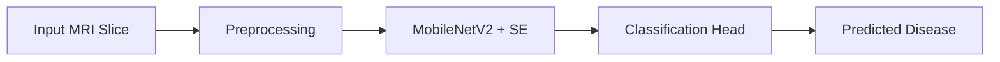

<h1 align="center">🧠 Neurodegenerative Disease Detection using CNN</h1>

  <b>🎓 Undergraduate Thesis Project (Completed)</b> 
  <i>Alzheimer’s, Parkinson’s & FTD Detection from MRI using Deep Learning</i>  
  
  
  

---

## 🚀 Overview

This research focuses on the early diagnosis of Alzheimer’s, Parkinson’s, and Frontotemporal Dementia (FTD) using 2D sagittal MRI slices with a pseudo-3D deep learning approach. The architecture leverages a lightweight MobileNetV2 backbone enhanced with Squeeze-and-Excitation (SE) attention blocks for efficient and interpretable classification.

> 🧾 Status: Thesis successfully submitted and defended at BRAC University, CSE Department.

> ⚠️ Note: Code and datasets are kept private to uphold ethical and institutional regulations.

---

## 📂 Datasets Used

- **ADNI**: Alzheimer's Disease Neuroimaging Initiative — https://adni.loni.usc.edu  
- **PPMI**: Parkinson’s Progression Markers Initiative — https://www.ppmi-info.org/  
- **FTD**: Neuroimaging in Frontotemporal Dementia — https://ida.loni.usc.edu  

MRI slices were processed using:
- Intensity clipping to range 0–255
- Conditional CLAHE for contrast enhancement
- Resizing to 224×224 resolution
- Normalization
- Stored as .png files for CNN input

---

## 🧪 Data Preprocessing Pipeline

---

## 🔧 Proposed Model Workflow

---

## 🧠 Model Architecture

- Base Model: MobileNetV2
- Enhancement: Squeeze-and-Excitation (SE) Attention Blocks
- Input Type: Pseudo-3D (Stacked 2D sagittal MRI slices)
- Optimizer: Adam (Learning rate = 1×10⁻⁵)
- Loss Function: Categorical Crossentropy

---

## 📊 Performance Summary

Our Proposed SadnetV1 gave us a solid result to detect Alzheimer's, Parkinson's and Fronto Temporal Dementia like-
Test- 96.15%
Validate- 97.11%
train- 96.84%
---

## 📈 Results & Visualizations

Accuracy graph

Loss graph

Test confusion matrix

---

## 🌍 Future Work

- Deploy as an interactive web app
- Incorporate multi-modal imaging (MRI + PET)

---

## 🛠️ Tools & Tech Used

- Python
- PyTorch
- OpenCV
- NumPy & Pandas
- Matplotlib & Seaborn
- DICOM & NiBabel for medical imaging
- Jupyter Notebook

---

## 📎 Author & Contact

Shadman Rahman Sameen  
Undergraduate Student, Dept. of CSE  
BRAC University, Dhaka, Bangladesh  
📧 shadman.rahman.sameen@g.bracu.ac.bd  
🔗 GitHub: https://github.com/ShadmanRahman786

---

<i>“Turning pixels into predictions, one scan at a time.”</i>

